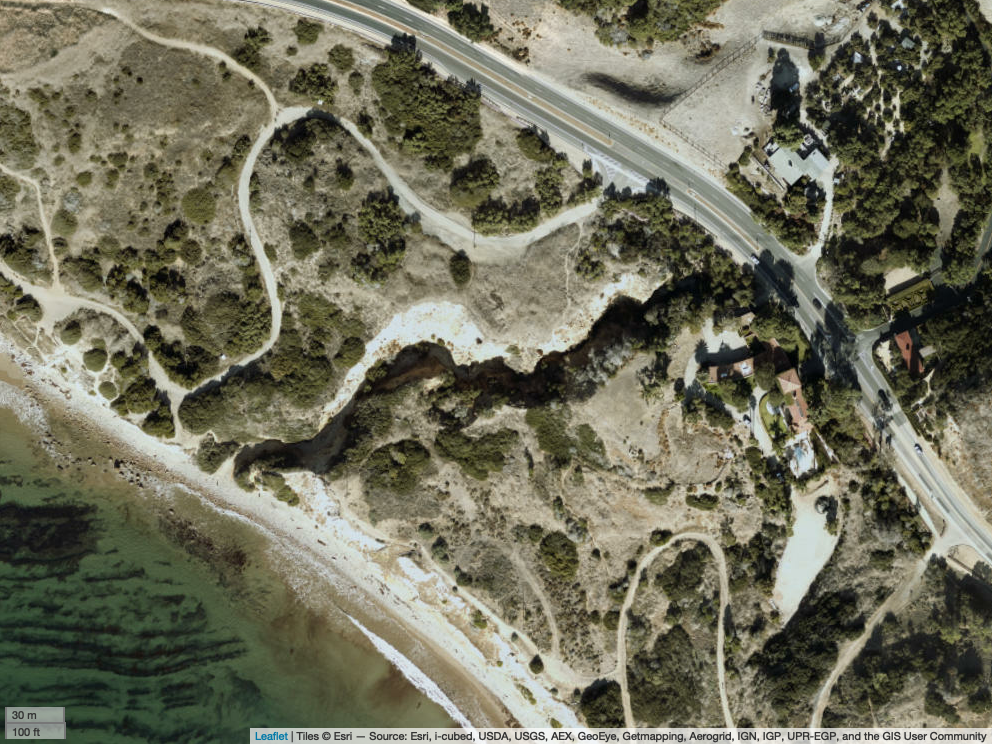

```{r, setup, include=FALSE}

# Removing all code from appearing in the final knit document.
knitr::opts_chunk$set(echo = FALSE)

# Removing all "#" from appearing in the final knit document.
knitr::opts_chunk$set(comment = NA)

```

***

## Classification:

```{r}
cat(params[["rf"]])
```

Final Classification:
```{r, out.width='100%', fig.align='center'}
knitr::include_graphics(here::here("01_H0_AI0_EPT0_ALG0_SI0_EPH-1.jpg"))
```

***

## General Site Information

Project name or number:
```{r}
# Adding cat() to all of the outputs to remove the [1] that would otherwise print immediately before them.
cat(params$a)
```

Site code or identifier:
```{r}
cat(params$c)
```

Assessor(s):
```{r}
cat(params$b)
```

Waterway name:
```{r}
cat(params$d)
```

Visit date:
```{r}
cat(params$e)
```

Current weather conditions:
```{r}
cat(params$bm)
```

Notes on current or recent weather conditions:
```{r}
cat(params$j)
```

Location:
```{r}
cat(paste0(params$g," N, ", params$h, " W"))
```

Location Map:
```{r}

# Used to test map functionality
#g <- 34.108355
#h <- -118.249169
#d <- "Glendale Narrows"

site_data <- data.frame(params$d, params$g, params$h) # create dataframe
names(site_data) <- c("site", "lat", "lon") # rename columns
site_sf <- st_as_sf(site_data, # create sf compatible dataframe
  coords = c("lon", "lat"), # identify lon & lat
  remove = F, # do not remove lat/lon columns
  crs = 4326) # use WGS84 projection

mapviewOptions(basemaps = "Esri.WorldImagery") # set output to be ESRI map
site_map <- mapview::mapview(site_sf, legend = FALSE) # adds in map

mapshot(site_map, file = paste0(getwd(), "/map.png"),
  selfcontained = FALSE) # exports map as a .png to temporary working directory

```

```{r, out.width='50%', fig.align='center'}

```

Datum:
```{r}
cat(params$i)
```

Surrounding land use within 100 m:
```{r}
cat(params$l)
```

Description of reach boundaries:
```{r}
cat(params$f)
```

Mean channel width (m):
```{r}
cat(params$p)
```

Reach length (m):
```{r}
cat(params$r)
```

Disturbed or difficult conditions:
```{r}
cat(params$bn)
```

Notes on disturbances or difficult site conditions:
```{r}
cat(params$k)
```

Observed hydrology:

Percent of reach with surface flow:
```{r}
cat(params$m)
```

Percent of reach with surface and sub-surface flows:
```{r}
cat(params$n)
```

Number of isolated pools:
```{r}
cat(params$o)
```

Comments on observed hydrology:
```{r}
cat(params$bo)
```

***

## Site Photos

Top of reach looking downstream:
```{r, out.width='25%', fig.align='center'}
knitr::include_graphics(params[["v"]])
```

Middle of reach looking upstream:
```{r, out.width='25%', fig.align='center'}
knitr::include_graphics(params[["u"]])
```

Middle of reach looking downstream:
```{r, out.width='25%', fig.align='center'}
knitr::include_graphics(params[["t"]])
```

Bottom of reach looking upstream:
```{r, out.width='25%', fig.align='center'}
knitr::include_graphics(params[["s"]])
```

## Site Sketch

```{r, out.width='25%', fig.align='center'}
knitr::include_graphics(params[["w"]])
```

***

## Hydrophytic Vegetation

Hydrophytic species found in or near the channel:
```{r}
cat(params$av)
```

```{r, out.width='25%', fig.align='center', fig.cap=params$ab}
knitr::include_graphics(params[["aa"]])
```

```{r, out.width='25%', fig.align='center', fig.cap=params$ad}
knitr::include_graphics(params[["ac"]])
```

```{r, out.width='25%', fig.align='center', fig.cap=params$af}
knitr::include_graphics(params[["ae"]])
```

```{r, out.width='25%', fig.align='center', fig.cap=params$ah}
knitr::include_graphics(params[["ag"]])
```

Notes on hydrophytic vegetation:
```{r}
cat(params$bc)
```

***

## Aquatic Invertebrates

Number of individuals observed:
```{r}
cat(params$ai)
```

Are EPT present?
```{r}
cat(params$aj)
```

```{r, out.width='25%', fig.align='center'}
knitr::include_graphics(params[["al"]])
```

```{r, out.width='25%', fig.align='center'}
knitr::include_graphics(params[["am"]])
```

Notes on aquatic invertebrates
```{r}
cat(params$an)
```

***

## Algae Cover

Cover of live or dead algal in the streambed:
```{r}
cat(params$ao)
```

```{r, out.width='25%', fig.align='center'}
knitr::include_graphics(params[["ap"]])
```

Notes on algae cover:
```{r}
cat(params$bb)
```

***

## Single Indicators

Fish (other than mosquitofish):
```{r}
cat(params$aq)
```

```{r, out.width='25%', fig.align='center'}
knitr::include_graphics(params[["ar"]])
```

Algae cover > 10%:
```{r}
cat(params$bk)
```

```{r, out.width='25%', fig.align='center'}
knitr::include_graphics(params[["bj"]])
```

***

## Supplemental Information
```{r}
cat(params$bf)
```

## Additional photo(s)

```{r, out.width='25%', fig.align='center', fig.cap = params$be}
knitr::include_graphics(params[["ba"]])
```

```{r, out.width='25%', fig.align='center', fig.cap = params$bi}
knitr::include_graphics(params[["bh"]])
```

## Additional notes about the assessment:
```{r}
cat(params$bg)
```

***
